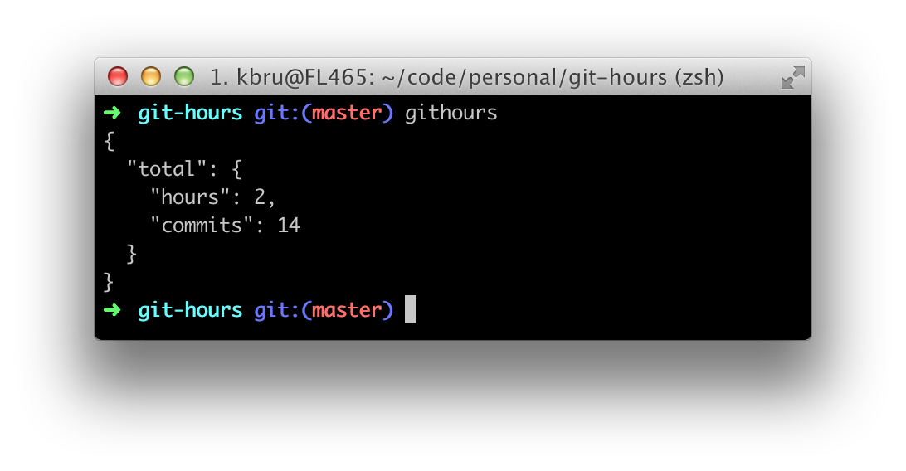

# Git hours

Estimate time spent on a git repository.

**Example**

## Usage

Simply run `githours` in root of a git repository.
**Note: repository is not detected if you are not in the root of repository!**

## Install

    npm install -g git-hours

You need to install mocha to run tests:

    npm install -g mocha grunt-cli

# For contributors

Documentation for git-hours developers.

## Release

* Commit all changes
* Run `grunt release`, which will create new tag and publish code to GitHub

    Travis will release newest tag to NPM

* Edit GitHub release notes

To see an example how to release minor/major, check https://github.com/geddski/grunt-release

## Test

Tests can be run with command

    grunt test

or

    npm test

You need to have *mocha* installed globally with `npm install -g mocha`.

## Release

* Commit all changes
* Run `grunt release`, which will create new tag and publish code to GitHub

    Travis will release newest tag to NPM

* Edit GitHub release notes
