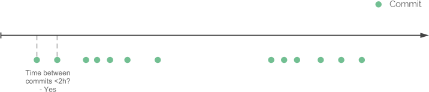

[](https://github.com/kimmobrunfeldt/git-hours/actions?query=branch%3Amain)

# git-hours

Estimate time spent on a git repository.

**For example time spent on [Twitter's Bootstrap](https://github.com/twbs/bootstrap)**

```javascript
➜  bootstrap git:(master) git-hours
{

  ...

  "total": {
    "hours": 9959,
    "commits": 11470
  }
}
```

From a person working 8 hours per day, it would take more than 3 years to build Bootstrap.

*Please note that the information might not be accurate enough to be used in billing.*

## Install

    $ npm install -g git-hours

**NOTE:** If for some reason `git-hours` won't work, try to `npm install -g nodegit`.

`git-hours` depends on [nodegit](https://github.com/nodegit/nodegit).
It might be a bit tricky to install. If installing git-hours fails for some
reason, probably it was because nodegit couldn't be installed.
Check [their documentation](https://github.com/nodegit/nodegit#getting-started) for troubleshooting.

## How it works

The algorithm for estimating hours is quite simple. For each author in the commit history, do the following:

<br><br>



*Go through all commits and compare the difference between
them in time.*

<br><br><br>


*If the difference is smaller or equal then a given threshold, group the commits
to a same coding session.*

<br><br><br>


*If the difference is bigger than a given threshold, the coding session is finished.*

<br><br><br>


*To compensate the first commit whose work is unknown, we add extra hours to the coding session.*

<br><br><br>


*Continue until we have determined all coding sessions and sum the hours
made by individual authors.*

<br>

The algorithm in [~30 lines of code](https://github.com/kimmobrunfeldt/git-hours/blob/8aaeee237cb9d9028e7a2592a25ad8468b1f45e4/index.js#L114-L143).

## Usage

In root of a git repository run:

    $ git-hours

**Note: repository is not detected if you are not in the root of repository!**

Help

    Usage: git-hours [options]

    Options:

      -h, --help                                 output usage information
      -V, --version                              output the version number
      -d, --max-commit-diff [max-commit-diff]    maximum difference in minutes between commits counted to one session. Default: 120
      -a, --first-commit-add [first-commit-add]  how many minutes first commit of session should add to total. Default: 120
      -s, --since [since-certain-date]           Analyze data since certain date. [always|yesterday|tonight|lastweek|yyyy-mm-dd] Default: always'
      -e, --email [emailOther=emailMain]         Group person by email address. Default: none
      -u, --until [until-certain-date]           Analyze data until certain date. [always|yesterday|today|lastweek|thisweek|yyyy-mm-dd] Default: always
      -m, --merge-request [false|true]           Include merge requests into calculation.  Default: true
      -p, --path [git-repo]                      Git repository to analyze. Default: .
      -b, --branch [branch-name]                 Analyze only data on the specified branch. Default: all branches

    Examples:

     - Estimate hours of project

         $ git-hours

     - Estimate hours in repository where developers commit more seldom: they might have 4h(240min) pause between commits

         $ git-hours --max-commit-diff 240

     - Estimate hours in repository where developer works 5 hours before first commit in day

         $ git-hours --first-commit-add 300

     - Estimate hours work in repository since yesterday

       $ git-hours --since yesterday

     - Estimate hours work in repository since 2015-01-31

       $ git-hours --since 2015-01-31

    - Estimate hours work in repository on the "master" branch

       $ git-hours --branch master

    For more details, visit https://github.com/kimmobrunfeldt/git-hours

